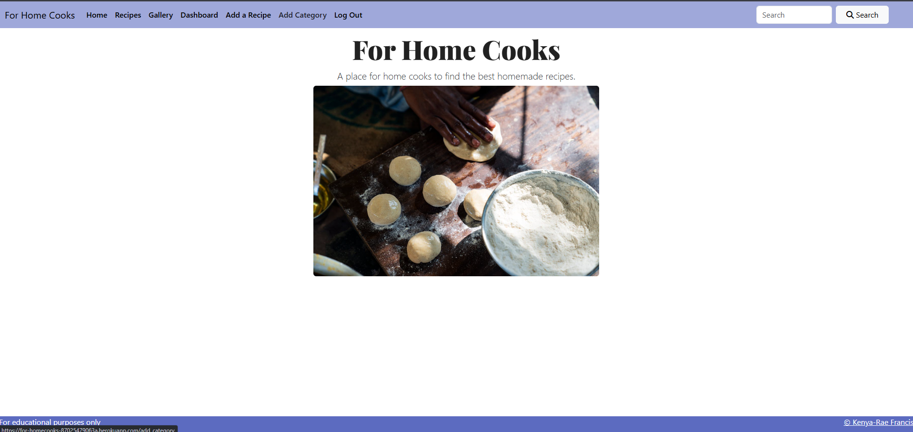
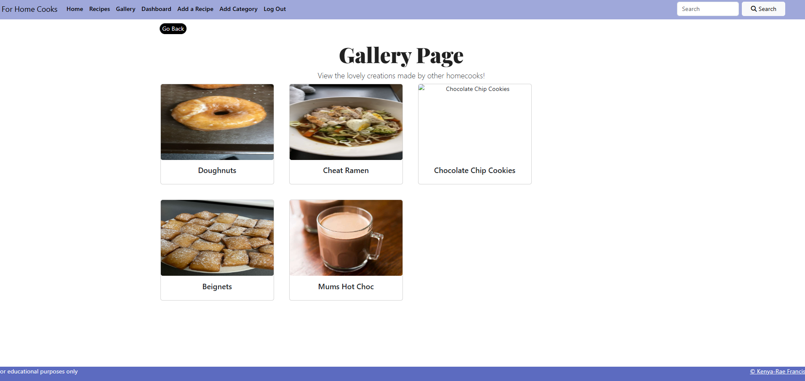
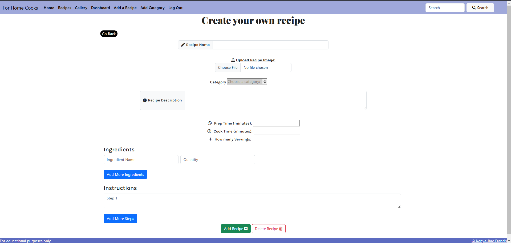
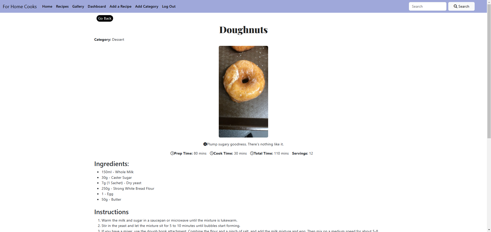
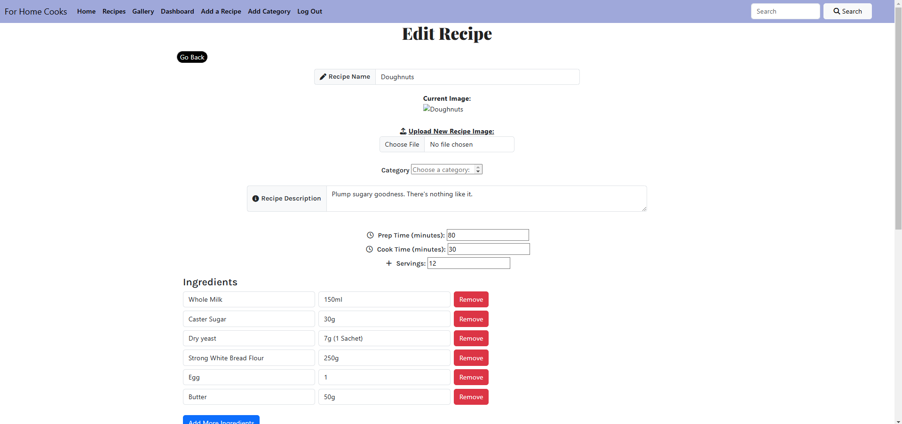
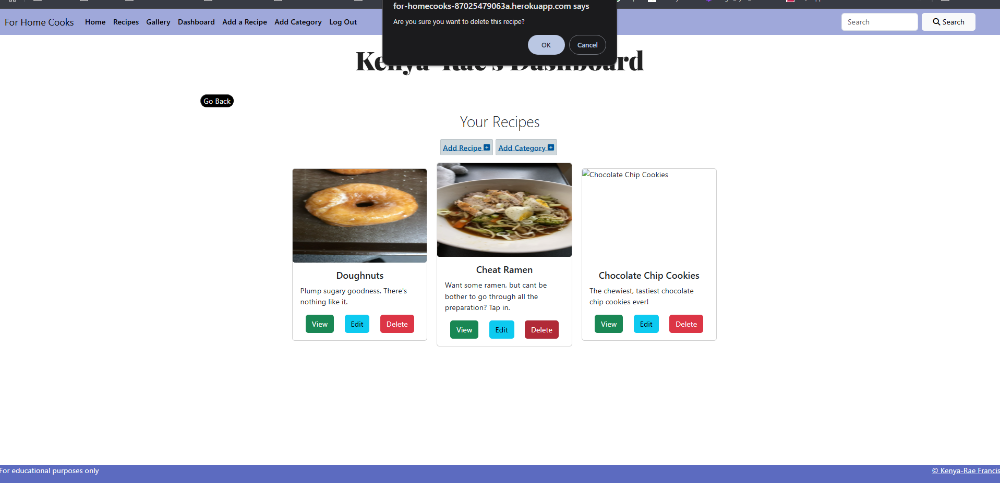
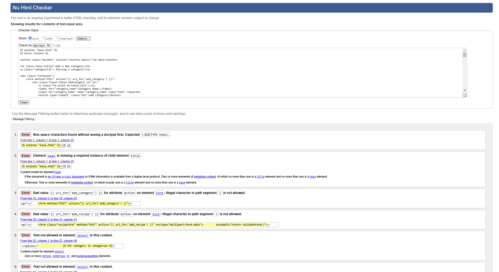
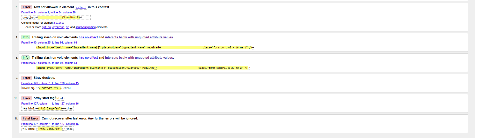
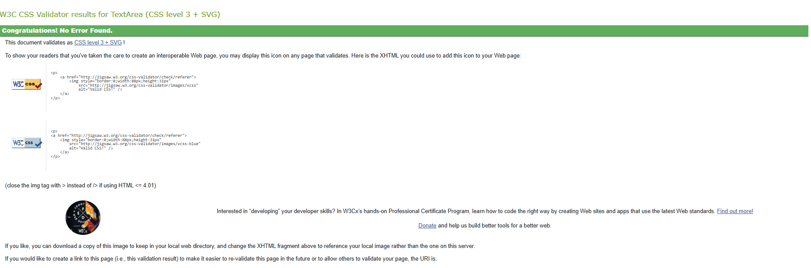
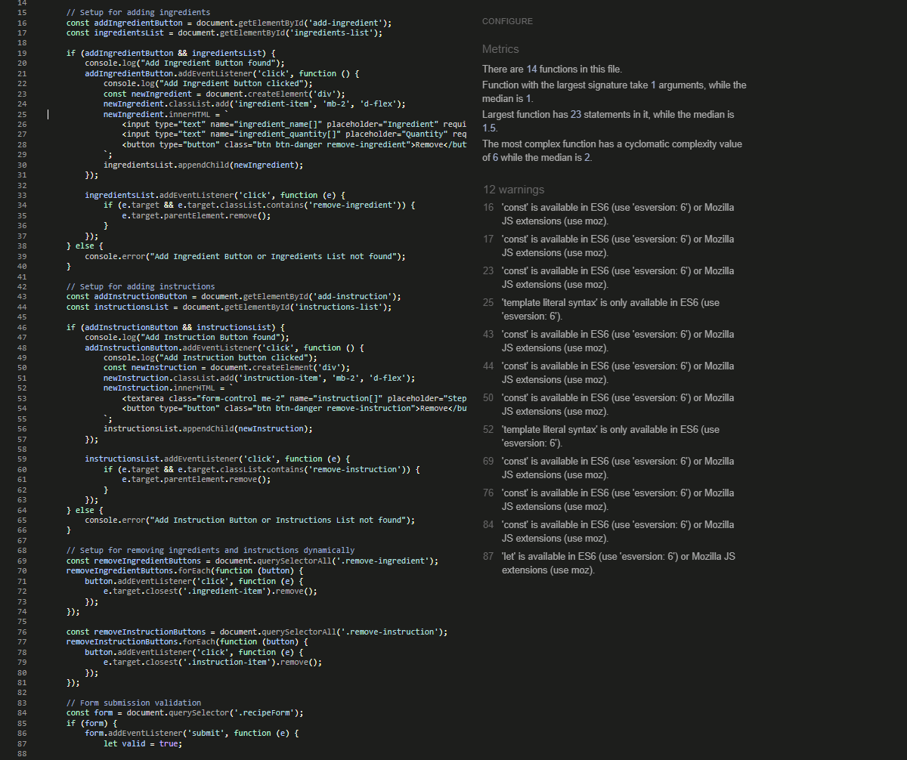

<h1 allign="center" id="title"> For Home Cooks </h1>

[Live Project can be viewed here.](https://for-homecooks-87025479063a.herokuapp.com/)

For Home Cooks is a recipe application for homecooks who are looking to widen their recipe catelogue.

## Table of Contents

### User Experience (UX)

- [Project Goals](#project-goals)
- [User Goals](#user-experience-ux)
- [Developer Goals](#developers-goals)
- [User Stories](#user-stories)
- [Design Choices](#design-choices)
- [Wireframes](#wireframes)

### Features

- [Future Features](#future-feautres)

### Testing

- [Manual Testing](#manual-testing)
- [Bugs](#bugs)

### Deployment

- [How to Deploy Site](#deployments)

### Credits

- [Credits](#credits)
- [Code](#code)
- [Acknowledgments](#acknowledgments)

## User Experience (UX)

### Project Goals

This project's goal is to build a full-stack site that allows your users to manage a common dataset about a particular domain. That is appealing to the users of this site. As well as improve my own developer skills and move out my comfort zone.

#### Recruiters Goals

The main audience for this site is anyone aged 8+ with parental guidance.

#### User Goals:

- Easily find and share recipes.
- Enjoy cooked goods.

#### Developers goals:

- Create an appealing, functional site.
- Demonstrate the use of full-stack development.
- Make site that allows users to find and share recipes.

#### User Stories

As a user I want:

- Search for recipes.
- To understand the instructions given.
- Share recipes.
- Consistent functionalities.

As the site owner I want:

- A site that provides search and share functions.
- A structured and PEP8 compliant.
- Demonstrate what I have learnt with Python and external libiraries such as Flask and Materialise.
- A site that functions and is consistent with handling data.

## Design Choices

### Languages Used

- HTML
- CSS
- JavaScript
- Python+Flask
- PostgreSQL

### Fonts

- Google Fonts was used to give the headers the Playfair Display and the sub headings Karla. These two were chosen as the constrast between the two were amacable. I didn't want to choose a font that was too formal for the site as this intended for sharing and finding recipes.

### Icons

- Font Awesome and Favicon were both used within this project.
- Font Awesome Icons were used for mostly form attributes and the search button. All icons, I've used are easily identifable and match according to the text its belongs with.
- I used Favicon to give my website a recognisable ID.

### Colours

- Within this project, I used materlise to get the hex colours for my site. I had choosen to go with minimal colours. This choice was due to how the website would be constructed, if there where multiple colours within this it could be too busy for the user. As the recipes and the page content will fullfill the visual side of the site. The only elements I intended to use colour on were buttons, navagation bar and footer. 

### Images
- Some images are from my personal gallery, though the a few where taken from google under the creative commons licenses. As this is a recipe site that allows users to add and share their own recipes. No other images where included in this project other than those assigned to a recipe.

### Wireframes

Wireframes were created using [Balsamiq](https://balsamiq.com/).

- [Home](/readme/wireframes/homepage.png)
- [Recipe Page](/readme/wireframes/recipe-page.png)
- [Recipe Genre Display](/wireframes/recipe-genre-display%20.png)
- [How To Make..](/readme/wireframes/how-to-page.png)
- [Gallery](/readme/wireframes/gallery.png)
- [Sign In](/readme/wireframes/sign-in.png)
- [Your Recipes](/readme/wireframes/your-recipes.png)
- [CRUD - Functionality](/readme/wireframes/crud-creating-update-selete-section.png)

## Features

- Navigation bar that alllows users to access different parts of the sites.
- Dropdown bar for quick search of categories within the recipes page
- Search box, allows users to find what they are looking for within the site.
- Sign up, login and logout feature to allow a user to sign up and have access adding to the database with their own recipes. They can logout of the session when they are finished using the site.
- Add recipes, users can add recipes to the site. Adding photo of the dish, instructions, ingredients and method. As well as asigning a category. This allows the user to use the create function in CRUD.
- Dashboard, for users to view their recipes they created on the site.
- View recipe route thats inbuilt to allow the read function of CRUD.
- Edit and delete recipes, this allows a user to use the update and delte functions within CRUD.
- Comments allow anyone that visits the site to comment on a recipe.
- Admin. Though currently I, the site owner is the admin of this project. This allows me (or future admin) to add categories to the site, this give a little more control of what is implemented on the site. Rather than allowing anyone that is signed up to have this access.

### Loaded page:

When you first load on the page you are met with the homepage.

User Interface

### Navigation:

Navigation

### Recipe Page:

Recipe Page

### Gallery Page:

Gallery Page

### CRUD Functionality:

Create

Read

Update

Delete

## Future Features
- Overall I would like to add more security to the site. For example, within the comments section. I would like to add a function to only allow signed up user to comment on a site. OR allow annoymous comments but filter out some words to protect vistors on the site.
- In continuation from my first point, adding a permissions page for admin users such as myself to allow others to become admins themselves. Possibly adding more roles to the site instead of the standard user and admin. 
- Finer details can be added to i.e dropboxes or recipes to be placed in alphabetical order, rather than when it was created. As well as this tune up the overall postionings and responsiveness.
- Within the homepage, I would love to include a display of cards which shows what the site offers without giving the whole site away.
- Delete category function. As I had forgotten to add this when creating it. Unfortunately don't have enough time to add this in.
- Images seem to display and then not display could be an access error within the file path.

## Accessibility

- Limited colours to reduce the contrasts.
- Added name tags to elements, included alt tags to images. 

## Testing

### Manual Testing

| What to test       | Expected Results                          | Passed |
| ------------------ | ----------------------------------------- | ------ |
| Navigation Menu    | Navigate site and send to correct pages   |&#x2714;|
| Search for recipe  | Display recipe when searched for          |&#x2714;|
| Add recipe to site | User can add recipe to the site           |&#x2714;|
| Sign Up Form       | Allow user to sign up to recipe site.     |&#x2714;|
| Login Form         | Allow user to login to recipe site.       |&#x2714;|
| Comments           | Allow user input within the recipe page.  |&#x2714;|
| Edit and Delete    | Edit or Delte recipes that users created. |        |
| Upload Images      | Add image of dish to recipe that a user created. |&#x2714;|
| View recipes       | Recipes can be viewed in dashboard and recipes page. |&#x2714;|

### For this project I have had friends and family, test amongst various devices. Such as;

- Ipad 10th
- iPhone 11 Pro
- HP Pavillion 17 Laptop

All the feedback given was consistent with my future features and current bugs. For example, the tweaking of css styles on some pages to ensure consistency. Though overall the feedback given was generally positive and a good experience on the site. The two external testers I had used for this project, aged from 30-60. The main take back that the testers wanted me to note was the ease of viewing and looking around the site. As it was "It was straight to the point, easy to use. Instead of the usual blog with the recipe". Which concludes my user and developer goals which was making a site that allows users to find and share recipes. As for users to find and share recipes.

One of the testers had signed up and managed to login successfully. They also fedback that they were able to add a recipe and it was straightforward.

### Lighthouse - Developer Chrome Tools

Lighthouse Overview

 

Lighthouse Acessibility

 

Lighthouse Diagnostics

 

## Validators

W3c was used to validate HTML, CSS. JShint was used for JavaScript code. Due to the time of submission, I'm unable to pick apart the erorrs. Though, some I beleive may be unavoidable within this project.

### HTML Validator:

HTML Validator Overview Part 1

 

HTML Validator 

 

### CSS Validator:

 

CSS Validator 

### JavaScript Validator:

JavaScript Validator

## Bugs

### Current Bugs

- Due to the time of this submition, some things have to be left. The forgot password function is functional in the sense of users recieve the email. Though the token was expired. I had tried debugging and shuffling my code and had changed the EmailJs template to reflect html instead, the hyperlink does not work. As I dont have enough time to debug and fully resolve this, I've added it here. 
- Card panel images or panel itself is protruding above the rest of the panels. Not sure why, had a look through dev tools and could find a solution currently for this.
- Edit function, seems to not fully work. I.e Categories and instructions are not updated. Unfortunately due to the time of submission I don't have time to look in to this further.
- Favicon icons are not display on browser tab. The .ico file is within the root and the links are wired up correctly.

 
  

  
Console Message

  

 

Console Message - After Change

### Fixed Bugs

- Materialise mobile navbar wouldn't initialise, switched over to Bootstrap for functionality for navbar and footer functions.
- Sign in/sign up form would push back an error due to the column variable name changes this hadnt migrated over on the recipes database. Once I made the migrations this allowed me to submit a form.
- Sign in/sign up form was refreshing the page instead of redirecting users to the correct URL links. This was due to some typo errors within my routes. Aswell as the incorrect use of url_for.
- Flask flash messages, was not displaying amongst pages. Due to the my template literals loops were not implemented correctly.
- Unable to add recipes due to no categories being added to the database/no admin user at the time to create these. Creating admin role as well as added categories manually.
- Unable to add categories due to no admin role access. All code for admin was implemented correctly. Though I hadnt acccessed the make_me_admin route to actually make changes.
- Add more buttons hadnt done anything within create recipe page, as I had not structured my scipt.js effectively.
- Search query error, when using the search box. This was due to the route not querying the database variables.

## Deployments

This project was deployed to GitHub Pages using the steps below;

### How to Deploy to GitHub Pages.

1. Open the browser, search GitHub and log in. If you do not have an account, sign up [here](https://github.com/login).
2. Locate and select the [For Home Cooks]().
3. Once the repository is open, select settings.
4. Select 'Pages', which is found on the left-hand side under the Code and Automation category.
5. Underneath build and deployment, there are two sub-heading 'Source' and 'Branch'. Select the 'None' dropdown below the branch sub-heading.
6. Change the 'None' option to 'Main', then press "Save".
7. Wait a few moments whilst the pages refresh. (This could take up to 5 minutes.)
8. You may need to refresh the page, to see the saved changes. You should have seen that the site and the link to the live site. An orange icon will display which will indicate that the save changes are still loading.
9. You can also check your deployment by selecting 'Code'. On the right-hand side, you should see 'Deployments'. Select 'Deployments' to view the status of your deployments.

### How to run this project locally.

To clone this project to Gitpod use the following steps;

1. Open the browser, search GitHub and log in. If you do not have an account, sign up [here](https://github.com/login).
2. Open a new tab, search Gitpod and log in. If you don't have an account, you can sign in with GitHub.
3. Open a new workspace.
4. Go back to the GitHub tab and locate [For Home Cooks](https://for-homecooks-87025479063a.herokuapp.com/).
5. Click the green "<> Code" button.
6. Under the HTTPS tab, copy the URL for the repository.
7. Go back to your Gitpod Workspace and open the terminal.
8. Change the location of your current working directory to where you want the cloned directory.
9. Type "git clone", then paste the URL that you had copied earlier from GitHub.
10. Press Enter to create your local clone.

### How to Fork this project.

To fork this project from Gitpod, please follow the steps below;

1. Open the browser, search GitHub and log in. If you do not have an account, sign up [here](https://github.com/login).
2. Locate the GitHub tab and locate the project you want to fork. [For Home Cooks](https://for-homecooks-87025479063a.herokuapp.com/)
3. At the top right-hand side of the page, you will see a "Fork" button. Click on the button and wait a few moments. You should see the new forked repository under your own GitHub account.
4. By default the folk is named as their upstream repositories, you can rename the repositories by typing a name in the "Repository name" field.
5. You can also add a description to your fork and/or copy the default branch only.
6. To also access the files in the repository. Head over to your forked repository. Click the green "<> Code" button.
7. Under the HTTPS tab, copy the URL for the repository.
8. Go to the workspace you have created earlier.
9. To change the current directory to the location where you want the cloned directory.
10. Type "git clone" and paste the URL you copied from GitHub. Press "Enter" and your local clone will be created.

### How to Deploy to Heroku. 

To deploy to Heroku, follow the steps below;

1. Within your project coding environment. Open the terminal and generate a requirements file via typing " pip freeze --local > requirements.txt "
2. In the root directory create a file called Procfile, ensure that a capital "P" is used to ensure Heroku reads this. Then within this file add " web: python run.py.
4. Use a database or object storage instead of writing to your local filesystem.
5. In Heroku, create a new app. 
6. Add a app name. Complete language-specific setup.
7. Select "Create App".
8. Explore the Heroku platform.
9. Within the settings, click "Reveal Config Vars". Use the variable within the env.py. Ensure that DEBUG, DEVELOPMENT and DB_URL is not included. As well as no strings in qoutes when adding the values.
10. Locate to the Deploy tab and navigate towards the "Deployment method" section, select “Connect to GitHub”.
11. Search for your repository and click Connect.
12. You can click "Enable Automatic Deploys" in case of any further changes to the project. This will push over when you make the push to GitHub.
13. If you are using the Manual deploy section and click Deploy Branch. This will start the build process.
14. Once this is completed. Navigate to the top of the page to the “More” button and select “Run console”.
15. Type python3 into the console and click Run.
16. Then type "from recipes import db". This will pull the database through
17. Type "db.create_all()" this will create all the models. You can exit the terminal by typing "exit()" and hitting enter, and close the console.
  <strong>Note: If any changes are made to models you will need to manually make the migrations within Heroku.</strong>
18. The app should running now, click the “Open app” button.
  <strong>Note: The deployed app will load, but as the new database is empty you will need to add in some data.</strong>

## Credits

### Frameworks, Libraries and Programs Used

- [Balsamiq](https://balsamiq.com/) - For creating wireframes.
- [GitHub](https://github.com/) - To store my repository and deploy site.
- [Gitpod](https://www.gitpod.io/) - Used to write code for this project.
- [Heroku](https://www.heroku.com/) - To deploy my application.
- [Flask](https://flask.palletsprojects.com/en/stable/) - For developing this web application using python.
- [Sqlalchemy](https://docs.sqlalchemy.org/en/13/intro.html#installation) - Used for creating the database.
- [EmailJs](https://www.emailjs.com/docs/) - Used in my forgot password route/function.
- [HTML Validation](https://validator.w3.org/) - To validate my HTML Code.
- [CSS Validation](https://jigsaw.w3.org/css-validator/) - To validate my CSS code.
- [JS Validation](https://jshint.com/) - To validate my script.

### Code

- [Coding2go](https://www.youtube.com/watch?v=bVl5_UdcAy0&t=201s) - Used this walkthrough for form validation.
- [Bootstrap Navagation Bar](https://getbootstrap.com/docs/4.1/components/navs/) - Navagation bar was used.
- [Bootstrap Forms](https://getbootstrap.com/docs/4.1/components/forms/) - For the forms and classes.
- [Bootstrap Buttons](https://getbootstrap.com/docs/4.1/components/buttons/) - Buttons were used and classes
- [Forgotten Password - Slack](https://stackoverflow.com/questions/1102781/best-way-for-a-forgot-password-implementation) - No code was taken from here but this was a good read that had lead into further researching.
- [Go back button](https://www.w3schools.com/jsref/met_his_back.asp) - For the go back button function.

### Acknowledgments

- Friends and Family that tested and supported through this project
- [Mitko](https://code-institute-room.slack.com/team/U03R20N303G) - My mentor, helped through my first session and gave me advice on how to move around this project.
- [Owen](https://code-institute-room.slack.com/team/U079BDNL2LV) - Would like to acknowlgde Owen for the suggestive words and personal experience he shared with his project. This was a nice eye opener to what I had coming forward.

[Back to top](#title)
